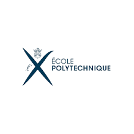
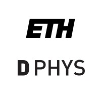
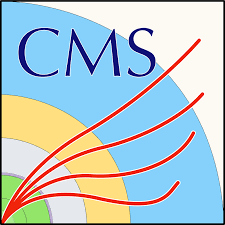

```{=html}
<div class="timeline">

  <div class="timeline-item">
      <div class="timeline-logo">
        
      </div>
      <div class="timeline-content">
        <div class="timeline-date">2026 – 2027</div>
        <div class="timeline-title">MSc. High Energy Physics</div>
        <div class="timeline-subtitle">École Polytechnique Paris (Dual Diploma with ETH Zürich)</div>
        <div class="timeline-description">
        </div>
      </div>
    </div>

  <div class="timeline-item">
    <div class="timeline-logo">
      
    </div>
    <div class="timeline-content">
      <div class="timeline-date">Summer 2026</div>
      <div class="timeline-title">Research and Innovation Trainee</div>
      <div class="timeline-subtitle">Bluefors Oy, Helsinki</div>
      <div class="timeline-description">
        Experimental low-temperature physics
      </div>
    </div>
  </div>

  <div class="timeline-item">
    <div class="timeline-logo">
      
    </div>
    <div class="timeline-content">
      <div class="timeline-date">2025 – 2026</div>
      <div class="timeline-title">MSc. High Energy Physics</div>
      <div class="timeline-subtitle">ETH Zürich (Dual Diploma with École Polytechnique)</div>
      <div class="timeline-description">
        Highlighted coursework:<br>
        - Neutrino Physics<br>
        - Phenomenology of Particle Physics I & II<br>
        - Experimental Foundations of Particle Physics<br>
        - Quantum Field Theory II<br>
        - Statistical Methods and Analysis Techniques in Experimental Physics<br>
        - Data Science in Techno-socio-economic Systems
      </div>
    </div>
  </div>

  <div class="timeline-item">
    <div class="timeline-logo">
      
    </div>
    <div class="timeline-content">
      <div class="timeline-date">2025 – 2026</div>
      <div class="timeline-title">Research Assistant</div>
      <div class="timeline-subtitle">CMS Experiment, CERN (Funded by <a href="https://www.smarthep.org/" class="highlight">smartHEP</a>, <a href="https://www.hip.fi/" class="highlight">HIP</a>)
      </div>
      <div class="timeline-description">
```
$X \to b\bar{b}$ scale factor calibration for Scouting Global Particle Transformer
```{=html}
      </div>
    </div>
  </div>

  <div class="timeline-item">
    <div class="timeline-logo">
      
    </div>
    <div class="timeline-content">
      <div class="timeline-date">Summer 2024</div>
      <div class="timeline-title">Research and Development Trainee</div>
      <div class="timeline-subtitle">Bluefors Oy, Helsinki</div>
      <div class="timeline-description">
        Developed a python library for numerical simulation of dilution refrigerator thermal evolution
      </div>
    </div>
  </div>

    <div class="timeline-item">
    <div class="timeline-logo">
      
    </div>
    <div class="timeline-content">
      <div class="timeline-date">Summer 2023</div>
      <div class="timeline-title">Vacuum Assembly Trainee</div>
      <div class="timeline-subtitle">Bluefors Oy, Helsinki</div>
      <div class="timeline-description">
        Constructed electrical and mechanical subcomponents for the vacuum cycle of the dilution refrigerator
      </div>
    </div>
  </div>

  <div class="timeline-item">
    <div class="timeline-logo">
      
    </div>
    <div class="timeline-content">
      <div class="timeline-date">2022 – 2025</div>
      <div class="timeline-title">BSc. Physics</div>
      <div class="timeline-subtitle">University of Helsinki</div>
      <div class="timeline-description">
        Graduated with 255/180 credits.<br>
        Highlighted coursework:<br>
        - Introduction to Machine Learning<br>
        - Neural Networks and Deep Learning<br>
        - Numerical Methods in Scientific Computing<br>
        - Computing Methods in High Energy Physics<br>
        - Electrodynamics I & II<br>
        - Quantum Computing<br>
        - Quantum Mechanics Ia - IIb<br>
        - Laboratory Course on Instrumentation<br>
      </div>
    </div>
  </div>
</div>
```