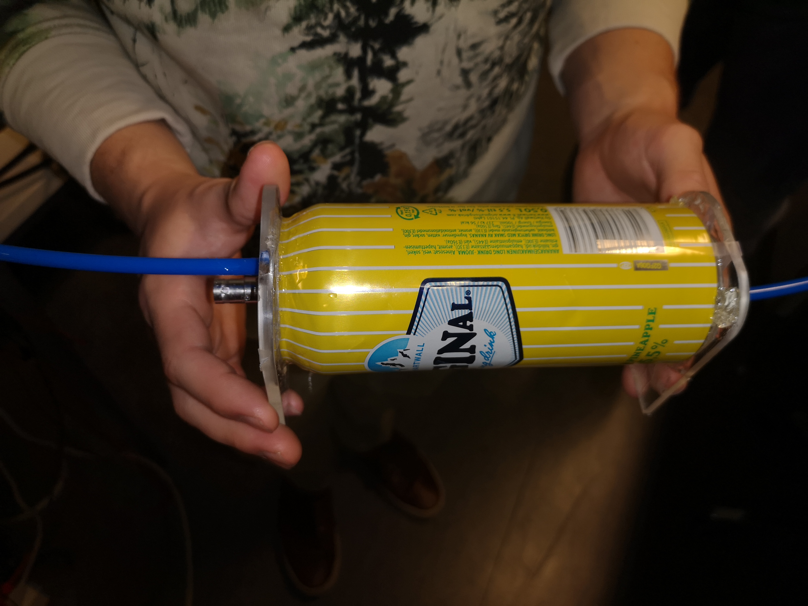
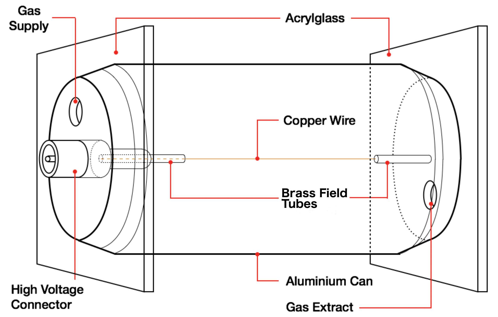

---
title: "Measuring X-ray spectra with a beer can"
--- 

An article by <a href="https://arxiv.org/pdf/1509.02379v2" class="highlight">Brücken et al. (2024)</a> demonstrated that a proportional counter could be constructed from cheap and easy to source materials, sufficient for use in student laboratories. My colleague and I replicated their work, and used the setup to identify the commonly cited peaks in the X-ray spectra of $^{55}$Fe, $^{133}$Ba, and $^{241}$Am under 100 keV.

\
```{=html}
<div style="display: flex; gap: 1.5rem; justify-content: center; flex-wrap: wrap;">
  
  <figure style="text-align: center; margin: 0;">
    
    <figcaption style="margin-top: 0.5rem; color: var(--bs-secondary-color, #6c757d);">Our detector</figcaption>
  </figure>

  <figure style="text-align: center; margin: 0;">
    
    <figcaption style="margin-top: 0.5rem; color: var(--bs-secondary-color, #6c757d);">Detector schematic (credit: Joshua Reed)</figcaption>
  </figure>

</div>
```
\
The detector operates on the proportional counter design. A thin copper wire is threaded through the beer can, acting as anode, with the aluminium shell acting as cathode. The can is filled with P10 gas, and the anode and cathode are subject to a large potential difference creating a strong electric field. When exposed to ionizing radiation, electrons are liberated from the gas and multiplied by the field as they drift towards the anode wire. Readout electronics are connected to the anode wire in order to record the ionization events' signal.


## Calibration
A large part of the work was calibrating the detector and determining its optimal operating regime.

A multi-channel analyzer was used for the readout electronics. 
It was first necessary to relate the charge measured by the detector to the multi-channel analyzer's channel number.
This was achieved by feeding known voltage pulses to the detector using a tail-pulse generator. 
The voltage pulse could be related to the collected charge in the detector via $Q = CV$ (assuming that the decay time of the collected
charge in the preamplifier was shorter than the pulse time), with $C = 1\,\mathrm{pf}$ the capacitance of the preamplifier's feedback circuit.


\
\
\
\


# Project Report
<figure style="text-align: center;">
  <embed src="../images/beer_can/beverage_can_proportional_counter.pdf" type="application/pdf" width="100%" height="1500px" style="max-width: 1300px; border: 1px solid var(--bs-border-color, #dee2e6); border-radius: 4px;">
  <figcaption style="margin-top: 0.5rem; color: var(--bs-secondary-color, #6c757d);"></figcaption>
</figure>